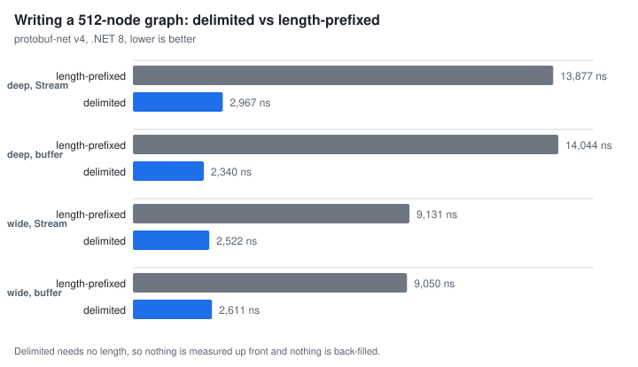

# Delimited encoding (groups)

Two ways exist to frame a sub-message on the wire, and protobuf-net supports both. The usual one is
**length-prefixed**: a tag, a varint length, then that many bytes. The other is **delimited**: a start tag,
the body, an end tag, and no length anywhere - what proto2 called a `group`, what
[editions](https://docs.protobuf-net.dev/editions) calls `features.message_encoding = DELIMITED`, and what
protobuf-net has always called `DataFormat.Group`.

Delimited is usually the **faster** of the two to write, sometimes by a lot, because nothing has to know how
long a message is before writing it. This page is about when that is worth having, how to ask for it from
both code-first and schema-first, and what it costs.

## On the wire

Length-prefixed is wire type 2: a tag, a varint length, then that many bytes. Delimited is wire type 3 to
open and wire type 4 to close: a start tag, the body, an end tag. Both are core protobuf, understood by every
complete implementation, and they carry exactly the same information.

protobuf-net has written and read this framing since **2008**: group reading landed on 23 July 2008, six
days after the project's first commit; group writing on 31 July; and it acquired its current spelling,
`DataFormat.Group`, on 13 August 2008. What it has *never* had is a way to say so in a `.proto` file:

- **proto2** had `group` syntax, but the group's body is declared inline and the field name is derived from
  the group name. That cannot express what protobuf-net does - an independently named member whose type is a
  separately declared (and possibly shared) message.
- **proto3** removed groups from the language entirely, while leaving the wire types perfectly valid.

Editions is the first dialect in which the intent has an exact spelling. The message is declared normally,
and the *field* says how it is framed:

``` proto
edition = "2023";

message Order {
  Address home = 3 [features.message_encoding = DELIMITED];
}
```

## Asking for it

Both directions work, and meet in the same place: the `DataFormat` on the member.

### Schema first

Generating from the schema above gives you the attribute protobuf-net has always understood -

``` c#
[global::ProtoBuf.ProtoMember(3, Name = @"home", DataFormat = global::ProtoBuf.DataFormat.Group)]
public Address Home { get; set; }
```

`.proto` files fed through [build-time generation](https://docs.protobuf-net.dev/contract_first), the
[`protogen` tool](https://www.nuget.org/packages/protobuf-net.Protogen) and
[protobuf-net.dev](https://protobuf-net.dev/) all produce the same thing.

### Code first

Declare it on the member. v4 adds `DataFormat.Delimited` as a synonym for the same value, matching the
editions vocabulary; `Group` is not deprecated, and remains what `protogen` emits -

``` c#
[ProtoContract]
public class Order
{
    [ProtoMember(1)] public int Id { get; set; }
    [ProtoMember(2, IsRequired = true)] public string Reference { get; set; }
    [ProtoMember(3, DataFormat = DataFormat.Group)] public Address Home { get; set; }
}
```

Existing contracts can be switched without touching the type, through the runtime model:

``` c#
RuntimeTypeModel.Default[typeof(Order)][3].DataFormat = DataFormat.Group;
```

Either way the model can now describe itself exactly, which is what editions bought:

``` c#
var schema = model.GetSchema(typeof(Order), ProtoSyntax.Edition2023);
```

``` proto
edition = "2023";
package ProtoBuf.Schemas;

message Address {
   string Line1 = 1;
}
message Order {
   int32 Id = 1;
   string Reference = 2 [features.field_presence = LEGACY_REQUIRED];
   Address Home = 3 [features.message_encoding = DELIMITED];
}
```

Ask the same model for proto2 or proto3 and it still writes `group Address Home = 3;`, but with a warning
comment above it: in proto3 that is not valid syntax at all, and in proto2 it is shorthand for a declaration
proto2 cannot actually make. Editions is the first dialect where the emitted schema needs no apology.

The bytes are not protobuf-net's own dialect of anything: for the same shape and data, protobuf-net's
`DataFormat.Group` output is byte-for-byte identical to what `protoc`'s C# generator plus `Google.Protobuf`
emit for `features.message_encoding = DELIMITED`, and likewise for the length-prefixed framing.

## Why you might want it



A length prefix has to be written *before* the body it describes, and its value is only known *after* the
body has been written. Every implementation resolves that somehow, and none of the options are free:

- measure the body first, then write it - a second pass over the object graph; or
- write the body into a buffer, then emit the length and copy the buffer out; or
- reserve space for the prefix, write the body, then go back and fill it in - and shuffle the body along if
  the length turned out to need more room than was reserved.

protobuf-net picks between them by target, and neither choice is free:

- Writing to a **`Stream`**, it takes the third route. One byte is reserved for the prefix, optimistically,
  and while a sub-message is open the writer holds a *flush lock* - nothing can go through to the underlying
  stream, because the reserved prefix and everything after it may still have to move. Nest sub-messages and
  the locks nest with them, so the whole nested payload stays resident until the outermost one closes; and
  every sub-message whose length needs more than the byte reserved memmoves its entire body along to make
  room.
- Writing to an **`IBufferWriter<byte>`**, it cannot do that: the buffer belongs to the caller, so the writer
  must be strictly forwards-only and nothing may be revised after the fact. It takes the first route instead
  - a measuring pass over the sub-message into a null writer, then the prefix, then the body. The buffer
  writer refuses the back-fill path outright: *"You must use the WriteMessage API with this writer type"*.

Delimited framing needs neither: a start tag, the body, an end tag - no lock, no back-fill, no measuring
pass, whichever the target. The writer never looks back and never has to hold anything, which is old enough
to be regression-tested: the repo has a test that builds a hundred thousand nested objects, serializes them
with `DataFormat.Group`, and asserts that the writer buffered nothing at all along the way.

### Numbers

`src/Benchmark/DelimitedEncodingBenchmarks.cs` in this repo measures both framings, in protobuf-net and in
Google.Protobuf, over two shapes - **deep** (a chain of `Size` nested messages) and **wide** (one message
with `Size` children) - serializing to both write targets, and deserializing. Both libraries write the same
bytes for a given framing (the benchmark asserts it before measuring), so every column below is the same
work done a different way. The same file runs on the 3.3 line and on v4, which is what makes those columns
comparable. Run it with:

``` txt
dotnet run -c Release -f net8.0 --project src/Benchmark -- --filter *DelimitedEncoding*
```

Numbers below are from an AMD Ryzen 9 7900X on .NET 8, BenchmarkDotNet 0.15.8, in nanoseconds; they are
here to show the *shape* of the effect, and are worth re-measuring on your own data rather than trusting to
three significant figures. **Bold marks the fastest of the four current-library cells in each row.** The v4
and Google.Protobuf columns are measured in the same process and so are directly comparable; the 3.3 columns
necessarily are not, since the released package and a local build share an assembly name and cannot be
referenced side by side. The v4 columns are from a development branch and will move; Google.Protobuf is
3.34.1 and is unaffected by which protobuf-net branch it is measured beside.

**Serialize to a `Stream`** - the back-fill route

| shape, size | 3.3 prefixed | 3.3 delimited | v4 prefixed | v4 delimited | Google prefixed | Google delimited |
| --- | ---: | ---: | ---: | ---: | ---: | ---: |
| deep, 8 | 284 | 264 | 160 | **124** | 174 | 131 |
| deep, 64 | 3,168 | 2,325 | 770 | **361** | 6,948 | 612 |
| deep, 512 | 90,798 | 77,941 | 5,870 | **2,917** | 776,843 | 4,620 |
| wide, 8 | 353 | 356 | 178 | **134** | 161 | 153 |
| wide, 64 | 2,177 | 2,111 | 693 | **386** | 754 | 673 |
| wide, 512 | 16,848 | 16,430 | 5,117 | **2,566** | 5,507 | 4,989 |

**Serialize to an `IBufferWriter<byte>`** - the measure-first route

| shape, size | 3.3 prefixed | 3.3 delimited | v4 prefixed | v4 delimited | Google prefixed | Google delimited |
| --- | ---: | ---: | ---: | ---: | ---: | ---: |
| deep, 8 | 638 | 277 | 185 | 126 | 154 | **86** |
| deep, 64 | 6,897 | 2,740 | 805 | **337** | 6,332 | 498 |
| deep, 512 | 120,501 | 81,601 | 5,846 | **2,389** | 666,432 | 4,324 |
| wide, 8 | 648 | 337 | 154 | 109 | 92 | **83** |
| wide, 64 | 4,308 | 2,182 | 673 | **353** | 648 | 571 |
| wide, 512 | 33,130 | 16,925 | 5,045 | **2,598** | 5,299 | 4,718 |

**Deserialize**

| shape, size | 3.3 prefixed | 3.3 delimited | v4 prefixed | v4 delimited | Google prefixed | Google delimited |
| --- | ---: | ---: | ---: | ---: | ---: | ---: |
| deep, 8 | 283 | 268 | 101 | **82** | 299 | 231 |
| deep, 64 | 1,784 | 1,754 | 728 | **604** | 1,669 | 1,191 |
| deep, 512 | 14,842 | 14,968 | **6,129** | 6,848 | 14,352 | 9,947 |
| wide, 8 | 439 | 408 | 138 | **120** | 321 | 276 |
| wide, 64 | 2,016 | 1,921 | 715 | **631** | 1,686 | 1,263 |
| wide, 512 | 14,635 | 13,557 | 5,245 | **4,693** | 12,767 | 9,216 |

Reading those honestly:

- **On v4, delimited is still the faster way to write, everywhere** - every serialize cell, on both
  targets - but the margin has narrowed from 2-6× to roughly 1.3-2.4×, because the length-prefixed side
  got faster rather than the delimited side slower. At depth 512 that is 5,870 ns against 2,917 to a
  stream, and 5,846 against 2,389 to a buffer writer. There is still no shape here where length-prefixing
  wins on the write side.
- **On 3.3 the answer depends on the target.** Writing to an `IBufferWriter<byte>`, where a prefix costs a
  measuring pass over each sub-message, delimited wins every cell by 1.5-2.5×. Writing to a `Stream`, where
  the prefix is back-filled instead, the win narrows to depth - 14% at depth 512, 27% at depth 64, and a wash
  when the graph is shallow or merely wide, because a small sub-message's length fits the byte reserved and
  nothing has to move.
- **Google.Protobuf's length-prefixed writer goes quadratic in depth.** Its generated `WriteTo` calls
  `CalculateSize()` on each sub-message before writing it, and that call walks the whole subtree, so writing
  a chain of *n* nested messages does *O(n²)* measuring work. At depth 512 that is 777 µs length-prefixed
  against 4.6 µs delimited: the same data, the same library, **168× apart**, purely because the delimited
  path never needs to know a length. protobuf-net measures each sub-message once, whatever the depth, and
  stays out of it.
- **Deserialization mildly prefers delimited**, and is the one place it can lose: the reader has to walk to
  the end tag where a length would have let it skip. It is 10-20% ahead in most cells; at depth 512 on v4 it
  is 12% *behind*, which is the deepest case and the one where skipping would have paid most.
- This is a framing comparison rather than a scoreboard, but for reference: v4 is ahead of Google.Protobuf
  in **every** deserialize cell and every delimited-write cell, and now in the length-prefixed writes too
  at 512 and (narrowly) at 64. What Google still leads is the *smallest* payloads - the 8-element cases -
  where what separates them is per-call setup cost rather than framing: protobuf-net spends around 28 ns
  opening and closing a writer before any bytes are written, which is a third of Google's entire time on a
  payload that small and is invisible by 512.

The numbers are from the compile-time model (`[ProtoModel]`); on 3.3 the reflection-based `RuntimeTypeModel`
path is 10-35% slower on serialize and about 1.8× slower on deserialize, with the same shape to the framing
comparison.

Allocations are in the benchmark output rather than the tables above, because the two libraries are not
directly comparable there: protobuf-net's serialize path allocates nothing at all, while Google's API builds
a fresh `CodedOutputStream` / `CodedInputStream` - and its buffer - per call, which the numbers include.

### Size

Delimited framing is never larger here, and at depth it is smaller. A length-prefixed field costs
`tag + varint(length)`; a delimited one costs `start tag + end tag`. Those are the same size while the body
stays under 128 bytes, and the delimited form wins as soon as the length needs a second varint byte - which
in a deep graph is true of every outer level:

| shape, size | length-prefixed | delimited |
| --- | ---: | ---: |
| deep, 8 | 30 | 30 |
| deep, 64 | 285 | 254 |
| deep, 512 | 2,917 | 2,431 |
| wide, 8 | 34 | 34 |
| wide, 64 | 258 | 258 |
| wide, 512 | 2,435 | 2,435 |

## When not to use it

- **Skipping is much cheaper with a length prefix** - though most reads skip nothing. Deserializing into a
  contract that declares the fields being sent, which is the ordinary case, consumes every byte: the whole
  payload is the payload you wanted. Skipping only arises for data the reader has no member for - a peer
  running a newer contract than yours, or a type that deliberately declares just the parts it cares about -
  and that is usually a thin tail rather than the body of the message.

  Where it *does* happen, the asymmetry is stark, because a length lets the reader jump the field entirely
  while a delimited body has to be walked to its end tag. Reading the payloads above into a contract
  declaring only field 1:

  | deep chain | length-prefixed | delimited |
  | --- | ---: | ---: |
  | depth 8 | 33 ns | 70 ns |
  | depth 64 | 33 ns | 389 ns |
  | depth 512 | 33 ns | 3,244 ns |

  The length-prefixed column is **flat** - skipping 512 levels costs the same as skipping 8, because the
  bytes are never touched at all - while the delimited column grows with the data, ending two orders of
  magnitude apart. So: if you are routinely handed large messages and read only a corner of them, keep the
  prefix. If you read what you are sent, this line costs you nothing.

- **Changing the framing changes the bytes** - though what that costs you depends entirely on who reads
  them. protobuf-net itself is relaxed: its reader dispatches on the wire type actually present, not on how
  the member is declared, so a protobuf-net consumer deserializes either framing either way round. Other
  implementations are generally not - `protoc`-generated parsers match on the whole tag, field number *and*
  wire type together, so a field that arrives in the framing they were not generated for falls through to
  their unknown-field set: it reads back as unset rather than as an error. Treat the switch as a wire break
  as soon as anything other than protobuf-net is reading, and as a rolling upgrade you can take at leisure
  when it is protobuf-net at both ends.
- **Not every consumer is willing.** The wire types are core protobuf and every complete implementation reads
  them, but a consumer generating from a proto3 schema has no way to *declare* the field, so they would be
  stuck hand-writing it. Editions is what fixes that - which is rather the point of this page.

## See also

- [Editions](https://docs.protobuf-net.dev/editions) - where `features.message_encoding = DELIMITED` comes from
- [Generating code from `.proto` files](https://docs.protobuf-net.dev/contract_first)
- [Editions feature settings](https://protobuf.dev/editions/features/) on protobuf.dev
